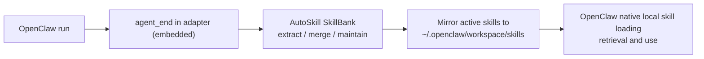

# AutoSkill4OpenClaw

English | [中文](README.zh-CN.md)

Teach OpenClaw new reusable skills without modifying OpenClaw core.

AutoSkill makes OpenClaw improve while it is being used: after a session ends, it can automatically extract reusable skills from the full interaction trajectory, merge or update older skills when better patterns appear, and keep OpenClaw's standard local `skills` directory up to date.  
In short, your agent gets better over time without patching OpenClaw core or manually curating every skill.

The default path runs directly with your existing OpenClaw setup.  
An optional external-service path is still available later for centralized operations and advanced deployment topologies.

## Install

### Prerequisites

- Python 3.10+
- A local checkout of this AutoSkill repository
- An existing OpenClaw installation
- Node.js is only needed if you want to run the adapter tests or local verification scripts
- `curl` is only needed for the optional sidecar verification script

For the recommended `embedded` mode, you do not need to provide a separate LLM provider or embedding provider during installation.
AutoSkill will reuse the current OpenClaw runtime/model path at execution time.
Keep this repository checkout on disk after installation: the installed runtime scripts still reference `AutoSkill4OpenClaw/run_proxy.py` from your local repo path.

### Recommended: install for embedded mode

This is the default path for most users.

It installs the adapter, wires `openclaw.json`, and prepares local directories for:

- session archiving
- SkillBank maintenance
- mirroring maintained skills into OpenClaw's native `skills` directory

It does **not** require you to pass `--llm-provider`, `--llm-model`, `--embeddings-provider`, or `--embeddings-model`.

```bash
git clone https://github.com/ECNU-ICALK/AutoSkill.git
cd AutoSkill
python3 -m pip install -e .
python3 AutoSkill4OpenClaw/install.py \
  --workspace-dir ~/.openclaw \
  --install-dir ~/.openclaw/plugins/autoskill-openclaw-plugin \
  --adapter-dir ~/.openclaw/extensions/autoskill-openclaw-adapter \
  --repo-dir "$(pwd)"
```

If you already have the repo locally:

```bash
cd /path/to/AutoSkill
python3 -m pip install -e .
python3 AutoSkill4OpenClaw/install.py \
  --workspace-dir ~/.openclaw \
  --install-dir ~/.openclaw/plugins/autoskill-openclaw-plugin \
  --adapter-dir ~/.openclaw/extensions/autoskill-openclaw-adapter \
  --repo-dir "$(pwd)"
```

After installation, the installer now writes an `embedded`-first default config into `~/.openclaw/openclaw.json` when the adapter entry does not already exist.
You only need to edit it manually if you want to override the default directories, change `sessionMaxTurns`, or switch to `sidecar`.

Notes:

- The installer still writes `.env` placeholders for optional sidecar/manual fallback paths.
- In embedded mode, those provider/env placeholders can stay empty.
- You do not need to start the AutoSkill sidecar process for the recommended embedded path.

### Optional: install for sidecar/manual-provider mode

Only use this if you explicitly want the external sidecar path or want to prefill provider defaults in the generated `.env`.

```bash
python3 AutoSkill4OpenClaw/install.py \
  --workspace-dir ~/.openclaw \
  --install-dir ~/.openclaw/plugins/autoskill-openclaw-plugin \
  --adapter-dir ~/.openclaw/extensions/autoskill-openclaw-adapter \
  --repo-dir "$(pwd)" \
  --llm-provider internlm \
  --llm-model intern-s1-pro \
  --embeddings-provider qwen \
  --embeddings-model text-embedding-v4
```

### What installation creates

- `~/.openclaw/plugins/autoskill-openclaw-plugin/.env`
- `~/.openclaw/plugins/autoskill-openclaw-plugin/run.sh`
- `~/.openclaw/plugins/autoskill-openclaw-plugin/start.sh`
- `~/.openclaw/plugins/autoskill-openclaw-plugin/stop.sh`
- `~/.openclaw/plugins/autoskill-openclaw-plugin/status.sh`
- `~/.openclaw/extensions/autoskill-openclaw-adapter/index.js`
- `~/.openclaw/extensions/autoskill-openclaw-adapter/openclaw.plugin.json`
- `~/.openclaw/extensions/autoskill-openclaw-adapter/package.json`
- `~/.openclaw/openclaw.json` with the adapter entry enabled

Naming note:

- the repository/project name is `AutoSkill4OpenClaw`
- the installed OpenClaw adapter id remains `autoskill-openclaw-adapter`
- the optional sidecar runtime install dir remains `~/.openclaw/plugins/autoskill-openclaw-plugin`
- those install/runtime identifiers are kept for compatibility with earlier setup and logs

## Quick Start (Recommended Default Path)

### 1. Set adapter runtime to embedded

The installer writes a plugin config like this into `~/.openclaw/openclaw.json` by default:

```json
{
  "plugins": {
    "entries": {
      "autoskill-openclaw-adapter": {
        "enabled": true,
        "config": {
          "runtimeMode": "embedded",
          "openclawSkillInstallMode": "openclaw_mirror",
          "embedded": {
            "skillBankDir": "~/.openclaw/autoskill/SkillBank",
            "openclawSkillsDir": "~/.openclaw/workspace/skills",
            "sessionArchiveDir": "~/.openclaw/autoskill/embedded_sessions",
            "sessionMaxTurns": 20,
            "liveExtractEveryTurns": 5
          }
        }
      }
    }
  }
}
```

`embedded.liveExtractEveryTurns` defaults to `5`. AutoSkill now runs one live extraction/maintenance pass every 5 turns for an active embedded session, so you do not need to wait for the session to end before useful skills start appearing. `embedded.sessionMaxTurns` still defaults to `20` as a long-session safeguard: if a session never ends and `session_id` never changes, AutoSkill closes that local archive segment after 20 turns and runs a closed-session pass instead of waiting forever. Closed sessions detected during `before_prompt_build` are processed asynchronously too, and startup recovery still scans previously closed files that were never processed. Set either `liveExtractEveryTurns` or `sessionMaxTurns` to `0` to disable that specific safeguard.

### 2. Restart OpenClaw

```bash
openclaw gateway restart
```

If your environment does not expose the `openclaw` CLI, restart the OpenClaw gateway/runtime through your normal service manager.

### 3. Check that the plugin is wired

```bash
cat ~/.openclaw/openclaw.json
```

You should see:

- `plugins.load.paths` contains `~/.openclaw/extensions/autoskill-openclaw-adapter`
- `plugins.entries.autoskill-openclaw-adapter.enabled = true`
- `plugins.entries.autoskill-openclaw-adapter.config.runtimeMode = embedded`

### 4. Verify skills are being maintained and mirrored

```bash
find ~/.openclaw/autoskill/SkillBank/Users -name SKILL.md | head
find ~/.openclaw/workspace/skills -name SKILL.md | head
```

The first path is AutoSkill source-of-truth SkillBank; the second is OpenClaw local skill mirror used by native retrieval.

## What This Plugin Does

### Recommended embedded path

This is the path most users should adopt first.



In this mode:

- OpenClaw adapter handles `agent_end` inside runtime (no sidecar required).
- The embedded runtime archives the transcript locally by session.
- The embedded runtime extracts and maintains skills in AutoSkill `SkillBank`.
- Generated skills can include standard OpenClaw bundled resources such as `scripts/`, `references/`, and `assets/`, and those files are preserved in SkillBank and in the mirror.
- The embedded runtime mirrors active skills into OpenClaw's standard local skills directory.
- OpenClaw uses those mirrored skills through its normal local skill mechanism.

### Why this is the default

- No OpenClaw core patching.
- No custom ContextEngine required.
- No system prompt replacement.
- No direct interference with memory, compaction, tools, provider selection, or model routing.
- OpenClaw keeps using its own standard local skill behavior.
- No external sidecar process required for the default path.

## Default Behavior

### Recommended install mode

The default install mode is:

```bash
AUTOSKILL_OPENCLAW_SKILL_INSTALL_MODE=openclaw_mirror
```

That means:

- AutoSkill `SkillBank` is the source of truth.
- OpenClaw local skills are an install mirror, not the source of truth.
- If a user already has a non-AutoSkill local skill folder with the same name, AutoSkill mirrors into a suffixed folder such as `<name>-autoskill` instead of overwriting that existing folder.
- `before_prompt_build` retrieval injection is disabled by default to avoid double retrieval and double guidance.
- In embedded mainline, `agent_end` is handled in adapter runtime and drives extraction/maintenance.
- If `before_prompt_build` closes a previous session because `session_id` changed or `sessionMaxTurns` was reached, that closed session is also processed asynchronously instead of being left in `embedded_sessions` only.
- For new deployments, explicitly set `runtimeMode=embedded` in adapter config.
- `runtimeMode=sidecar` remains available for optional externalized deployment.

### Shared prompt pack (sidecar + embedded)

To keep extraction/merge/maintenance decisions consistent across runtimes, both paths now read a shared prompt pack:

- Source file: `AutoSkill4OpenClaw/adapter/openclaw_prompt_pack.txt`
- Sidecar prompt profile (`agentic_prompt_profile.py`) renders `sidecar.*` templates from this file
- Embedded runtime (`adapter/embedded_runtime.js`) renders `embedded.*` templates from the same file

Optional override:

```bash
AUTOSKILL_OPENCLAW_PROMPT_PACK_PATH=/abs/path/to/openclaw_prompt_pack.txt
```

You can also set it in adapter config:

```json
{
  "plugins": {
    "entries": {
      "autoskill-openclaw-adapter": {
        "config": {
          "embedded": {
            "promptPackPath": "/abs/path/to/openclaw_prompt_pack.txt"
          }
        }
      }
    }
  }
}
```

If the prompt pack is missing or invalid, both runtimes fail open and fall back to built-in prompts.

### What gets stored locally

- SkillBank: `~/.openclaw/autoskill/SkillBank`
- Embedded session archive: `~/.openclaw/autoskill/embedded_sessions`
- Embedded live session snapshot (updated every incoming turn): `~/.openclaw/autoskill/embedded_sessions/<user>/<session>.latest.json`
- Embedded processed-session ledger: `~/.openclaw/autoskill/embedded_sessions/.autoskill_embedded_processed.jsonl`
- Mirrored OpenClaw local skills: `~/.openclaw/workspace/skills`
  AutoSkill-managed mirrored folders include `.autoskill-managed.json` so only AutoSkill-owned mirrors are overwritten automatically.
- Sidecar conversation archive (`runtimeMode=sidecar`): `~/.openclaw/autoskill/conversations`

Long-lived session safeguard:

- Embedded mode live checkpoint extraction: `embedded.liveExtractEveryTurns` defaults to `5`
- Embedded mode: `embedded.sessionMaxTurns` defaults to `20`
- Sidecar/session archive path: `AUTOSKILL_OPENCLAW_SESSION_MAX_TURNS` defaults to `20`
- Set either value to `0` if you want to wait strictly for `session_done`, session id change, or idle timeout

### Skill Usage Counters (safe-by-default)

The runtime supports lightweight usage counters, aligned with AutoSkill's core counter model:

- `retrieved`: how many times a skill appeared in tracked retrieval results
- `relevant`: whether the skill was selected for context/use in that turn
- `used`: usage count (explicit and/or inferred depending on the bucket)

The stats API now returns three buckets:

- `skills_explicit`: strict counters from explicit runtime signals (safe source for pruning)
- `skills_inferred`: fallback counters inferred from selected ids / message mentions when explicit usage is missing
- `skills_combined`: additive view (`explicit + inferred`) for observability only

Important safety defaults:

- tracking is best-effort and never blocks prompt/extraction flow
- counter errors are swallowed and only logged
- auto-prune is disabled by default (`AUTOSKILL_OPENCLAW_USAGE_PRUNE_ENABLED=0`)
- inferred counters are enabled by default to improve coverage when runtime signals are sparse
- in `openclaw_mirror`, explicit `used` counters still depend on runtime usage signals (if available)
- even when prune is enabled, prune is blocked by default unless current payload includes explicit `used_skill_ids` (`AUTOSKILL_OPENCLAW_USAGE_PRUNE_REQUIRE_EXPLICIT_USED_SIGNAL=1`)
- prune decisions use explicit counters only (`skills_explicit`) by design

Inspect counters (sidecar runtime only):

```bash
curl -X POST http://127.0.0.1:9100/v1/autoskill/openclaw/usage/stats \
  -H "Content-Type: application/json" \
  -d '{"user":"<your_user_id>"}'
```

Recommended prune guardrails (only after observing counters for a while):

```bash
AUTOSKILL_OPENCLAW_USAGE_PRUNE_ENABLED=1
AUTOSKILL_OPENCLAW_USAGE_PRUNE_MIN_RETRIEVED=40
AUTOSKILL_OPENCLAW_USAGE_PRUNE_MAX_USED=0
```

## Runtime Options

### 1. No-sidecar embedded runtime (OpenClaw model, recommended)

Use this as the default mainline.

In this mode:

- `agent_end` is handled inside the plugin runtime
- session data is archived per `session_id` and only closed sessions are extracted
- extraction runs only if the closed session contains at least one successful `turn_type=main`
- extracted skills are maintained under AutoSkill `SkillBank`
- whenever a skill is added or merged, the plugin mirrors that skill into OpenClaw local skills immediately

Key settings:

```bash
AUTOSKILL_OPENCLAW_RUNTIME_MODE=embedded
# convenience alias (equivalent fallback):
# AUTOSKILL_OPENCLAW_NO_SIDECAR=1
AUTOSKILL_OPENCLAW_SKILL_INSTALL_MODE=openclaw_mirror
AUTOSKILL_SKILLBANK_DIR=/path/to/AutoSkill/SkillBank
AUTOSKILL_OPENCLAW_SKILLS_DIR=~/.openclaw/workspace/skills
```

Notes:

- no extra model config is required by default; embedded extraction uses a fallback chain:
  - `openclaw-runtime`: first try direct runtime model invocation API; if unavailable, try runtime-resolved target (`base_url/api_key/model`) and call OpenAI-compatible `/chat/completions`
  - `openclaw-runtime-subagent`: call OpenClaw runtime sub-agent/internal reasoning entry if available
  - `openclaw-config-resolve`: read OpenClaw config files (`openclaw.json`, `models.json`, etc.) to resolve provider/model/base_url
  - `manual`: final fallback from explicit plugin config/env values
- maintenance retrieval uses BM25 in embedded mode
- maintenance safety guards in embedded mode:
  - duplicate candidate skills are skipped before maintenance decision
  - merge is allowed only with explicit/valid target id or high-confidence top BM25 hit
  - unsafe merge target degrades to `add` (no blind merge)
- OpenClaw compatibility fallback:
  - if `turn_type/turnType` is missing (observed on some OpenClaw 2026.3.x builds), adapter infers turn type from messages (`user` present => `main`, tool-only => `side`)
  - explicit `turn_type` still has highest priority when provided
  - if `session_done` is missing, session closing still works via `session_id` change (and sidecar idle-timeout close when enabled)
- `before_prompt_build` retrieval is auto-disabled by default on the embedded `openclaw_mirror` mainline; `store_only` remains the explicit exception that turns retrieval injection back on
- recursion guard is enabled for internal extraction/merge calls
- precedence: explicit `runtimeMode` config overrides the no-sidecar alias

### Embedded troubleshooting: `embedded_sessions` has files but `SkillBank` stays empty

Check these first:

- confirm whether you expect live checkpoint extraction or closed-session extraction
- for live extraction, check whether the session has already reached `embedded.liveExtractEveryTurns` turns
- for closed extraction, confirm you see closed session files and not only `<session>.jsonl` / `<session>.latest.json`
- after upgrading, restart OpenClaw once so embedded startup recovery can scan older closed session files
- check plugin logs for:
  - `embedded live checkpoints processed source=before_prompt_build_live ...`
  - `embedded agent_end status=...`
  - `embedded closed sessions processed source=before_prompt_build ...`
  - `embedded model call failed across modes: ...`
- confirm the closed session contains at least one successful `turn_type=main`
- confirm `skillBankDir` points to the directory you are actually checking

Typical causes:

- the active session has not yet reached the live checkpoint threshold
- the session is closed but contains no successful `main` turn
- model invocation fallback chain cannot reach any usable OpenClaw/runtime/manual target
- you are only looking at live archive files and not the closed `*.session_done.*` / `*.session_id_changed.*` / `*.session_turn_limit.*` files

### 2. `store_only` plus `before_prompt_build` injection

Use this only if you do not want skills mirrored into OpenClaw local skills.

In this mode:

- skills stay in AutoSkill store
- the adapter retrieves skills before prompt build
- the adapter injects a short additive skill hint block

Important properties:

- it only uses `before_prompt_build`
- it does not replace `systemPrompt`
- it does not mutate `messages`
- it does not touch memory slots or contextEngine
- it still follows the original AutoSkill retrieval flow: `query rewrite -> retrieval`

Enable it by switching to:

```bash
AUTOSKILL_OPENCLAW_SKILL_INSTALL_MODE=store_only
```

Or explicitly:

```bash
AUTOSKILL_SKILL_RETRIEVAL_ENABLED=1
```

### 3. Sidecar runtime (optional external control plane)

Use sidecar mode only when you explicitly want:

- centralized external service for extraction/maintenance/operations
- independent sidecar lifecycle (`start.sh` / `stop.sh`)
- shared endpoints for extraction event inspection and external automation

Enable sidecar mode by setting `runtimeMode=sidecar` and configuring `baseUrl`.

### 4. Advanced main-turn proxy (sidecar-only)

Use this only if you want more precise `main turn -> next state` sampling than `agent_end` can provide.

The sidecar exposes:

- `POST /v1/chat/completions`

When OpenClaw model traffic is routed there, the sidecar:

- samples only `turn_type == main`
- waits for the next request in the same session
- uses the final `user` / `tool` / `environment` message as `next_state`
- schedules extraction only after the turn boundary is complete

Important:

- `AUTOSKILL_OPENCLAW_MAIN_TURN_EXTRACT=1` is the default
- the chat proxy only becomes usable after `AUTOSKILL_OPENCLAW_PROXY_TARGET_BASE_URL` is configured
- if the target is not configured, `/v1/chat/completions` returns `503`
- in that case, online extraction automatically falls back to `agent_end`

## Sidecar Interaction (Optional Mode)

### Online extraction path in sidecar mode

When `runtimeMode=sidecar`, OpenClaw sends end-of-task data through:

- `POST /v1/autoskill/openclaw/hooks/agent_end`

The sidecar then:

1. archives the transcript locally
2. checks whether extraction should run
3. updates `SkillBank`
4. mirrors active skills into OpenClaw local skills

### Relationship between `agent_end` and main-turn proxy (sidecar mode)

- If main-turn proxy is active and model traffic really goes through sidecar `/v1/chat/completions`, main-turn extraction is preferred.
- In that setup, `agent_end` becomes archive-only and does not schedule a second extraction job.
- If main-turn proxy is not active, or the upstream target is not configured, `agent_end` remains the online extraction path.
- Fallback extraction only runs for payloads with `turn_type == main`.
- A hard dedupe guard is enforced: if a closed session already has non-failed `openclaw_main_turn_proxy` extraction events, `agent_end` session-close fallback skips that session.
- Session-close fallback can now close stale active sessions using optional idle timeout (`AUTOSKILL_OPENCLAW_SESSION_IDLE_TIMEOUT_S`).

## Useful Operations

### Start / stop / status (sidecar runtime only)

```bash
~/.openclaw/plugins/autoskill-openclaw-plugin/start.sh
~/.openclaw/plugins/autoskill-openclaw-plugin/status.sh
~/.openclaw/plugins/autoskill-openclaw-plugin/stop.sh
```

### Manual mirror sync (sidecar runtime only)

```bash
curl -X POST http://127.0.0.1:9100/v1/autoskill/openclaw/skills/sync \
  -H "Content-Type: application/json" \
  -d '{"user":"u1"}'
```

### Extraction events (sidecar runtime only)

```bash
curl http://127.0.0.1:9100/v1/autoskill/extractions/latest?user=<user_id>
curl -N http://127.0.0.1:9100/v1/autoskill/extractions/<job_id>/events
```

### Offline conversation import (sidecar runtime only)

```bash
curl -X POST http://127.0.0.1:9100/v1/autoskill/conversations/import \
  -H "Content-Type: application/json" \
  -d '{
    "conversations": [
      {
        "messages": [
          {"role":"user","content":"Write a policy memo."},
          {"role":"assistant","content":"Draft ..."},
          {"role":"user","content":"Make it more specific."}
        ]
      }
    ]
  }'
```

### Acceptance scripts (sidecar / embedded)

```bash
# sidecar runtime smoke check (health/capabilities/hooks/extraction event)
bash AutoSkill4OpenClaw/scripts/verify_sidecar.sh

# embedded runtime smoke check (adapter embedded tests)
bash AutoSkill4OpenClaw/scripts/verify_embedded.sh
```

## Key Environment Variables

### Core runtime (service/sidecar)

- `AUTOSKILL_PROXY_HOST`
- `AUTOSKILL_PROXY_PORT`
- `AUTOSKILL_STORE_DIR`
- `AUTOSKILL_LLM_PROVIDER`
- `AUTOSKILL_LLM_MODEL`
- `AUTOSKILL_EMBEDDINGS_PROVIDER`
- `AUTOSKILL_EMBEDDINGS_MODEL`
- `AUTOSKILL_PROXY_API_KEY`

### Recommended embedded path

- `AUTOSKILL_OPENCLAW_RUNTIME_MODE=embedded`
- `AUTOSKILL_OPENCLAW_SKILL_INSTALL_MODE=openclaw_mirror`
- `AUTOSKILL_SKILLBANK_DIR`
- `AUTOSKILL_OPENCLAW_SKILLS_DIR`
- `AUTOSKILL_OPENCLAW_EMBEDDED_SESSION_DIR`

### Optional retrieval injection path

- `AUTOSKILL_SKILL_RETRIEVAL_ENABLED`
- `AUTOSKILL_SKILL_RETRIEVAL_TOP_K`
- `AUTOSKILL_SKILL_RETRIEVAL_MAX_CHARS`
- `AUTOSKILL_SKILL_RETRIEVAL_MIN_SCORE`
- `AUTOSKILL_SKILL_RETRIEVAL_INJECTION_MODE`
- `AUTOSKILL_REWRITE_MODE`

### Optional main-turn proxy path (sidecar-only)

- `AUTOSKILL_OPENCLAW_MAIN_TURN_EXTRACT`
- `AUTOSKILL_OPENCLAW_AGENT_END_EXTRACT`
- `AUTOSKILL_OPENCLAW_PROXY_TARGET_BASE_URL`
- `AUTOSKILL_OPENCLAW_PROXY_TARGET_API_KEY`
- `AUTOSKILL_OPENCLAW_PROXY_CONNECT_TIMEOUT_S`
- `AUTOSKILL_OPENCLAW_PROXY_READ_TIMEOUT_S`
- `AUTOSKILL_OPENCLAW_INGEST_WINDOW`

### Optional embedded invocation fallback path

- `AUTOSKILL_OPENCLAW_EMBEDDED_MODEL_MODES`
  - default: `openclaw-runtime,openclaw-runtime-subagent,openclaw-config-resolve,manual`
- `AUTOSKILL_OPENCLAW_EMBEDDED_MODEL_TIMEOUT_MS`
- `AUTOSKILL_OPENCLAW_EMBEDDED_MODEL_RETRIES`
- `AUTOSKILL_OPENCLAW_EMBEDDED_OPENCLAW_HOME`
- `AUTOSKILL_OPENCLAW_EMBEDDED_MANUAL_BASE_URL`
- `AUTOSKILL_OPENCLAW_EMBEDDED_MANUAL_API_KEY`
- `AUTOSKILL_OPENCLAW_EMBEDDED_MANUAL_MODEL`

## API Summary

### Core OpenClaw-facing endpoints

- `POST /v1/autoskill/openclaw/hooks/agent_end`
- `POST /v1/autoskill/openclaw/hooks/before_agent_start`
- `POST /v1/autoskill/openclaw/skills/sync`
- `POST /v1/autoskill/openclaw/turn`
- `POST /v1/chat/completions` for the optional main-turn proxy

### Skill and extraction endpoints

- `POST /v1/autoskill/extractions`
- `GET /v1/autoskill/extractions/latest`
- `GET /v1/autoskill/extractions`
- `GET /v1/autoskill/extractions/{job_id}`
- `GET /v1/autoskill/extractions/{job_id}/events`
- `POST /v1/autoskill/conversations/import`
- `POST /v1/autoskill/skills/search`
- `GET /v1/autoskill/skills`
- `GET /v1/autoskill/skills/{skill_id}`
- `PUT /v1/autoskill/skills/{skill_id}/md`
- `DELETE /v1/autoskill/skills/{skill_id}`
- `POST /v1/autoskill/skills/{skill_id}/rollback`

## Repository and Install Paths

- GitHub source:
  [AutoSkill4OpenClaw on GitHub](https://github.com/ECNU-ICALK/AutoSkill/tree/main/AutoSkill4OpenClaw)
- Repo manifest:
  `AutoSkill4OpenClaw/sidecar.manifest.json`
- Runtime install dir:
  `~/.openclaw/plugins/autoskill-openclaw-plugin`
- Adapter dir:
  `~/.openclaw/extensions/autoskill-openclaw-adapter`
- OpenClaw config:
  `~/.openclaw/openclaw.json`

## Notes

- The plugin does not replace OpenClaw memory behavior.
- The plugin does not require a custom ContextEngine.
- In the default mirror mode, OpenClaw uses standard local skills instead of a second retrieval layer.
- Sidecar mode is optional; embedded mode is the recommended mainline.
- If `openclaw.json` is invalid JSON, the installer stops instead of overwriting it.
