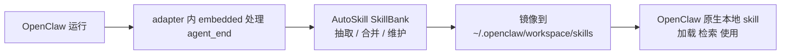

# AutoSkill4OpenClaw

[English](README.md) | 中文

让 OpenClaw 在不改核心代码的前提下，持续学会新技能。

AutoSkill 的核心意图是让 OpenClaw 在使用过程中自动进化：每个会话结束后，自动从完整交互轨迹里抽取可复用技能；当发现更好的做法时，自动合并或更新旧技能；并把最新可用技能同步到 OpenClaw 标准本地 `skills` 目录。  
你不需要改 OpenClaw 核心，也不需要手工维护每一条技能。

默认路径可直接在你现有 OpenClaw 环境中运行。  
如果后续需要集中化运维或更复杂部署，再使用可选的外置服务路径。

## 安装

### 前置依赖

- Python 3.10+
- 本地已有 AutoSkill 仓库
- 已安装可运行的 OpenClaw
- 只有在你要运行 adapter 测试或本地验证脚本时，才需要 Node.js
- 只有在你要运行可选的 sidecar 验证脚本时，才需要 `curl`

对于推荐的 `embedded` 模式，安装阶段不需要额外提供一套 `LLM provider` 或 `embedding provider`。
AutoSkill 会在真正执行抽取/维护时，优先复用当前 OpenClaw 运行时里的模型链路。
安装完成后请保留这份仓库 checkout：当前安装出来的运行时脚本仍然会引用本地仓库里的 `AutoSkill4OpenClaw/run_proxy.py`。

### 推荐方式：按 embedded 模式安装

这是大多数用户应该直接采用的默认路径。

它会完成 adapter 安装、写入 `openclaw.json`，并准备好以下本地目录：

- 会话归档
- SkillBank 维护
- 镜像到 OpenClaw 原生 `skills` 目录

这个安装命令**不需要**你传入 `--llm-provider`、`--llm-model`、`--embeddings-provider`、`--embeddings-model`。

```bash
git clone https://github.com/ECNU-ICALK/AutoSkill.git
cd AutoSkill
python3 -m pip install -e .
python3 AutoSkill4OpenClaw/install.py \
  --workspace-dir ~/.openclaw \
  --install-dir ~/.openclaw/plugins/autoskill-openclaw-plugin \
  --adapter-dir ~/.openclaw/extensions/autoskill-openclaw-adapter \
  --repo-dir "$(pwd)"
```

如果仓库已经在本地：

```bash
cd /path/to/AutoSkill
python3 -m pip install -e .
python3 AutoSkill4OpenClaw/install.py \
  --workspace-dir ~/.openclaw \
  --install-dir ~/.openclaw/plugins/autoskill-openclaw-plugin \
  --adapter-dir ~/.openclaw/extensions/autoskill-openclaw-adapter \
  --repo-dir "$(pwd)"
```

安装完成后，如果 adapter 条目原本不存在，安装器会直接把一套以 `embedded` 为主的默认配置写进 `~/.openclaw/openclaw.json`。
只有在你想改目录、调整 `sessionMaxTurns`，或者切换成 `sidecar` 时，才需要再手动编辑。

说明：

- 安装器仍会生成 `.env` 里的 sidecar / manual 兜底占位项。
- 但在 embedded 模式下，这些 provider/env 占位值可以先保持为空。
- 推荐 embedded 路径下，不需要额外启动 AutoSkill sidecar 进程。

### 可选方式：按 sidecar / 手动 provider 模式安装

只有在你明确要走外置 sidecar，或者想在安装时就预填 `.env` 里的 provider 默认值时，才需要这样安装：

```bash
python3 AutoSkill4OpenClaw/install.py \
  --workspace-dir ~/.openclaw \
  --install-dir ~/.openclaw/plugins/autoskill-openclaw-plugin \
  --adapter-dir ~/.openclaw/extensions/autoskill-openclaw-adapter \
  --repo-dir "$(pwd)" \
  --llm-provider internlm \
  --llm-model intern-s1-pro \
  --embeddings-provider qwen \
  --embeddings-model text-embedding-v4
```

### 安装后会生成什么

- `~/.openclaw/plugins/autoskill-openclaw-plugin/.env`
- `~/.openclaw/plugins/autoskill-openclaw-plugin/run.sh`
- `~/.openclaw/plugins/autoskill-openclaw-plugin/start.sh`
- `~/.openclaw/plugins/autoskill-openclaw-plugin/stop.sh`
- `~/.openclaw/plugins/autoskill-openclaw-plugin/status.sh`
- `~/.openclaw/extensions/autoskill-openclaw-adapter/index.js`
- `~/.openclaw/extensions/autoskill-openclaw-adapter/openclaw.plugin.json`
- `~/.openclaw/extensions/autoskill-openclaw-adapter/package.json`
- `~/.openclaw/openclaw.json`，并自动启用 adapter

命名说明：

- 仓库/项目名是 `AutoSkill4OpenClaw`
- 安装到 OpenClaw 里的 adapter id 仍然是 `autoskill-openclaw-adapter`
- 可选 sidecar 运行时目录仍然是 `~/.openclaw/plugins/autoskill-openclaw-plugin`
- 这些安装名/运行时名暂时保留，是为了兼容已有安装路径、日志与脚本

## 快速开始（推荐默认路径）

### 1. 将 adapter 运行模式设为 embedded

安装器默认会把下面这样的插件配置写入 `~/.openclaw/openclaw.json`：

```json
{
  "plugins": {
    "entries": {
      "autoskill-openclaw-adapter": {
        "enabled": true,
        "config": {
          "runtimeMode": "embedded",
          "openclawSkillInstallMode": "openclaw_mirror",
          "embedded": {
            "skillBankDir": "~/.openclaw/autoskill/SkillBank",
            "openclawSkillsDir": "~/.openclaw/workspace/skills",
            "sessionArchiveDir": "~/.openclaw/autoskill/embedded_sessions",
            "sessionMaxTurns": 20,
            "liveExtractEveryTurns": 5
          }
        }
      }
    }
  }
}
```

`embedded.liveExtractEveryTurns` 默认是 `5`。AutoSkill 现在会对活跃中的 embedded session 每 5 个 turn 做一次实时抽取/维护，不需要等到整段会话结束才产出技能。`embedded.sessionMaxTurns` 仍默认 `20`，作为长会话兜底：如果一个 session 很长、`session_id` 一直不变，AutoSkill 会在本地把这段会话按 20 个 turn 自动收口一次，并触发一轮闭合会话抽取/维护，而不是无限等待。现在如果会话是在 `before_prompt_build` 阶段因为 `session_id` 切换或 turn-limit 被收口，也会异步继续处理，不会只停留在 `embedded_sessions` 里。启动时 embedded 模式还会额外扫描一次“之前已经闭合但尚未处理”的 session 文件。若你想关闭某一条机制，把对应的 `liveExtractEveryTurns` 或 `sessionMaxTurns` 设成 `0`。

### 2. 重启 OpenClaw

```bash
openclaw gateway restart
```

如果你的环境没有 `openclaw` CLI，就用现有的服务管理方式重启 OpenClaw gateway/runtime。

### 3. 确认插件已经接上

```bash
cat ~/.openclaw/openclaw.json
```

你应该能看到：

- `plugins.load.paths` 包含 `~/.openclaw/extensions/autoskill-openclaw-adapter`
- `plugins.entries.autoskill-openclaw-adapter.enabled = true`
- `plugins.entries.autoskill-openclaw-adapter.config.runtimeMode = embedded`

### 4. 验证技能已维护并镜像

```bash
find ~/.openclaw/autoskill/SkillBank/Users -name SKILL.md | head
find ~/.openclaw/workspace/skills -name SKILL.md | head
```

前者是 AutoSkill 真源 SkillBank，后者是 OpenClaw 原生检索使用的本地 skills 镜像。

## 这个插件到底做什么

### 推荐 embedded 主线

这是大多数用户最应该先采用的路径。



在这个模式下：

- OpenClaw adapter 在运行时内处理 `agent_end`（不需要 sidecar）
- embedded runtime 先按 session 归档 transcript
- embedded runtime 在 AutoSkill `SkillBank` 中完成技能抽取与维护
- 生成的技能可以携带标准 OpenClaw `scripts/`、`references/`、`assets/` 等资源文件，并会在 SkillBank 与镜像目录中一并保留
- embedded runtime 把当前有效技能镜像到 OpenClaw 标准本地 skills 目录
- OpenClaw 继续通过自己的标准本地 skill 机制来使用这些技能

### 为什么默认推荐这条路

- 不需要改 OpenClaw 核心
- 不需要自定义 ContextEngine
- 不替换 system prompt
- 不直接干扰 memory、compaction、tools、provider 选择
- OpenClaw 继续按它原本的本地 skill 行为工作
- 默认主线不需要额外维护 sidecar 进程

## 默认行为

### 默认安装模式

默认安装模式是：

```bash
AUTOSKILL_OPENCLAW_SKILL_INSTALL_MODE=openclaw_mirror
```

这意味着：

- AutoSkill `SkillBank` 是技能真源
- OpenClaw 本地 skills 目录只是安装镜像，不是真源
- 如果用户自己已经在 OpenClaw 本地 skills 目录里放了同名但非 AutoSkill 管理的 skill，AutoSkill 会改用 `<name>-autoskill` 这类后缀目录镜像，不会直接覆盖原目录
- `before_prompt_build` 的检索注入默认关闭，避免重复检索、重复提示
- 在 embedded 主线下，`agent_end` 在 adapter 运行时内驱动抽取与维护
- 如果 `before_prompt_build` 因为 `session_id` 变化或 `sessionMaxTurns` 命中而收口了旧会话，这个闭合会话也会异步继续处理，不会只归档不抽取
- 新部署建议显式把 `runtimeMode` 设为 `embedded`
- `runtimeMode=sidecar` 仍保留为可选外置部署路径

### 共享提示词包（sidecar + embedded）

为避免两条运行时路径出现提示词漂移，sidecar 和 embedded 现在共用同一份提示词包：

- 源文件：`AutoSkill4OpenClaw/adapter/openclaw_prompt_pack.txt`
- sidecar（`agentic_prompt_profile.py`）读取 `sidecar.*` 模板
- embedded（`adapter/embedded_runtime.js`）读取 `embedded.*` 模板

可选覆盖路径：

```bash
AUTOSKILL_OPENCLAW_PROMPT_PACK_PATH=/abs/path/to/openclaw_prompt_pack.txt
```

也可以直接在 adapter 配置中写：

```json
{
  "plugins": {
    "entries": {
      "autoskill-openclaw-adapter": {
        "config": {
          "embedded": {
            "promptPackPath": "/abs/path/to/openclaw_prompt_pack.txt"
          }
        }
      }
    }
  }
}
```

如果提示词包缺失或解析失败，两条路径都会 fail-open，自动回退到内置提示词，不会阻断主流程。

### 本地会存什么

- SkillBank：`~/.openclaw/autoskill/SkillBank`
- embedded 会话归档：`~/.openclaw/autoskill/embedded_sessions`
- embedded 实时会话快照（每次收到 turn 都会更新）：`~/.openclaw/autoskill/embedded_sessions/<user>/<session>.latest.json`
- embedded 已处理会话账本：`~/.openclaw/autoskill/embedded_sessions/.autoskill_embedded_processed.jsonl`
- OpenClaw 本地技能镜像：`~/.openclaw/workspace/skills`
  AutoSkill 管理的镜像目录会带 `.autoskill-managed.json`，后续自动覆盖时只会覆盖这些 AutoSkill 自己创建的目录
- sidecar 对话归档（`runtimeMode=sidecar`）：`~/.openclaw/autoskill/conversations`

长会话兜底收口：

- embedded 实时 checkpoint 抽取：`embedded.liveExtractEveryTurns` 默认 `5`
- embedded 模式：`embedded.sessionMaxTurns` 默认 `20`
- sidecar / session archive 路径：`AUTOSKILL_OPENCLAW_SESSION_MAX_TURNS` 默认 `20`
- 如需完全等待 `session_done`、session 切换或 idle-timeout，再把对应值设成 `0`

### 技能使用计数（默认安全模式）

运行时支持与 AutoSkill 核心一致的轻量计数模型：

- `retrieved`：技能被检索命中的次数
- `relevant`：该轮是否被选入上下文/使用集合
- `used`：技能被使用次数（取决于计数桶是显式还是推断）

统计接口现在会返回三类计数：

- `skills_explicit`：只基于运行时显式信号的严格计数（清理决策使用它）
- `skills_inferred`：当显式信号缺失时，基于候选选择信息/消息线索的兜底推断计数
- `skills_combined`：观测视角的汇总计数（`explicit + inferred`）

安全默认策略：

- 统计是 best-effort，不会阻塞主链路
- 统计异常只记日志，不中断对话/抽取
- 默认不自动删技能（`AUTOSKILL_OPENCLAW_USAGE_PRUNE_ENABLED=0`）
- 默认开启推断计数，用于补齐显式信号稀疏时的可观测性
- `openclaw_mirror` 模式下，显式 `used` 计数仍依赖运行时是否有显式“已使用技能”信号
- 即使开启自动清理，默认也要求当前请求带有显式 `used_skill_ids` 才会执行 prune（`AUTOSKILL_OPENCLAW_USAGE_PRUNE_REQUIRE_EXPLICIT_USED_SIGNAL=1`）
- prune 只看显式计数（`skills_explicit`），避免误删

查看计数（仅 sidecar 运行时）：

```bash
curl -X POST http://127.0.0.1:9100/v1/autoskill/openclaw/usage/stats \
  -H "Content-Type: application/json" \
  -d '{"user":"<your_user_id>"}'
```

建议在观察一段时间后再开启自动清理：

```bash
AUTOSKILL_OPENCLAW_USAGE_PRUNE_ENABLED=1
AUTOSKILL_OPENCLAW_USAGE_PRUNE_MIN_RETRIEVED=40
AUTOSKILL_OPENCLAW_USAGE_PRUNE_MAX_USED=0
```

## 运行模式与路径

### 1. 无 sidecar 的 embedded 模式（复用 OpenClaw 当前模型，推荐）

把它当作默认主线即可。

这个模式下：

- `agent_end` 在插件进程内直接处理
- 对话按 `session_id` 归档，只有会话闭合后才会抽取
- 只有闭合会话里存在至少一条成功的 `turn_type=main` 才会触发抽取
- 抽取后的技能维护在 AutoSkill `SkillBank`
- 一旦技能发生新增/合并，立即镜像到 OpenClaw 本地 skills 目录

核心配置：

```bash
AUTOSKILL_OPENCLAW_RUNTIME_MODE=embedded
# 便捷别名（等价兜底）：
# AUTOSKILL_OPENCLAW_NO_SIDECAR=1
AUTOSKILL_OPENCLAW_SKILL_INSTALL_MODE=openclaw_mirror
AUTOSKILL_SKILLBANK_DIR=/path/to/AutoSkill/SkillBank
AUTOSKILL_OPENCLAW_SKILLS_DIR=~/.openclaw/workspace/skills
```

说明：

- 默认不需要手动再配一套抽取模型；embedded 抽取使用以下回退链：
  - `openclaw-runtime`：先尝试 runtime 直接模型调用；若不可用，再尝试从 runtime 对象解析 `base_url/api_key/model` 并走 OpenAI-compatible `/chat/completions`
  - `openclaw-runtime-subagent`：尝试调用 OpenClaw runtime 的子 agent / 内部推理入口
  - `openclaw-config-resolve`：读取 OpenClaw 配置文件（`openclaw.json`、`models.json` 等）解析 provider/model/base_url
  - `manual`：最后才使用显式手填配置
- embedded 模式下技能维护检索使用 BM25
- embedded 模式下维护安全护栏：
  - 抽取候选若与现有技能重复，会在维护决策前直接跳过
  - merge 只在目标 id 有效，或 BM25 高置信命中时允许
  - 不安全的 merge 目标会自动降级为 `add`（避免盲目合并）
- OpenClaw 兼容兜底：
  - 若缺少 `turn_type/turnType`（部分 OpenClaw 2026.3.x 版本会出现），adapter 会按消息结构推断（存在 `user` 视为 `main`，仅 tool/environment 视为 `side`）
  - 一旦上游显式提供 `turn_type`，仍以显式字段为准
  - 若缺少 `session_done`，仍可通过 `session_id` 变化收口（sidecar 开启空闲超时时也可自动收口）
- embedded 的 `openclaw_mirror` 主线上，`before_prompt_build` 检索默认自动关闭；`store_only` 是明确的例外路径，会重新开启检索注入
- 内置防递归保护，避免抽取/合并过程再次触发抽取链路
- 优先级说明：若显式配置 `runtimeMode`，会覆盖 no-sidecar 别名

### Embedded 排障：`embedded_sessions` 有文件，但 `SkillBank` 一直是空的

先看这几项：

- 先确认你期待的是“实时 checkpoint 抽取”还是“闭合后抽取”
- 如果是实时抽取，先看这个 session 是否已经达到 `embedded.liveExtractEveryTurns`
- 如果是闭合后抽取，确认你看到的是“闭合后的 session 文件”，而不只是 `<session>.jsonl` live 文件和 `<session>.latest.json`
- 升级后至少重启一次 OpenClaw，让 embedded 启动恢复逻辑扫描历史闭合文件
- 检查插件日志里是否出现：
  - `embedded live checkpoints processed source=before_prompt_build_live ...`
  - `embedded agent_end status=...`
  - `embedded closed sessions processed source=before_prompt_build ...`
  - `embedded model call failed across modes: ...`
- 确认这个闭合会话里至少有一条成功的 `turn_type=main`
- 确认 `skillBankDir` 就是你实际在检查的目录

最常见的原因：

- 活跃 session 还没达到实时 checkpoint 阈值
- session 虽然闭合了，但里面没有成功的 `main` turn
- embedded 模型调用回退链没能拿到可用的 OpenClaw/runtime/manual 目标
- 你只看到了 live 归档文件，没有看 `*.session_done.*` / `*.session_id_changed.*` / `*.session_turn_limit.*` 这些闭合文件

### 2. `store_only` 加 `before_prompt_build` 注入

只有当你不想把技能镜像安装到 OpenClaw 本地 skills 目录时，才建议用这条路。

这个模式下：

- 技能只保存在 AutoSkill store
- adapter 会在 prompt build 前做技能检索
- adapter 会把简短技能提示块追加到 prompt 中

它有几个关键性质：

- 只用 `before_prompt_build`
- 不替换 `systemPrompt`
- 不修改 `messages`
- 不触碰 memory slot 或 contextEngine
- 检索链路仍然遵循原来的 AutoSkill 逻辑：`query rewrite -> retrieval`

开启方式：

```bash
AUTOSKILL_OPENCLAW_SKILL_INSTALL_MODE=store_only
```

或者显式：

```bash
AUTOSKILL_SKILL_RETRIEVAL_ENABLED=1
```

### 3. sidecar 运行模式（可选外置控制面）

只有在你明确需要以下能力时才建议 sidecar：

- 外置集中服务做抽取/维护/运维
- sidecar 独立生命周期管理（`start.sh` / `stop.sh`）
- 共享事件接口给外部系统自动化使用

开启方式：设 `runtimeMode=sidecar` 并配置 `baseUrl`。

### 4. 高级 main-turn proxy（仅 sidecar）

只有当你需要比 `agent_end` 更精确的 `main turn -> next state` 采样时，才建议启用这条路。

sidecar 会暴露：

- `POST /v1/chat/completions`

当 OpenClaw 的模型流量走到这里时，sidecar 会：

- 只采样 `turn_type == main`
- 等同一 session 的下一次请求
- 用最后一条 `user` / `tool` / `environment` 作为 `next_state`
- 在 turn 边界真正补全后再调度抽取

要点：

- `AUTOSKILL_OPENCLAW_MAIN_TURN_EXTRACT=1` 默认就是开启的
- 只有配置了 `AUTOSKILL_OPENCLAW_PROXY_TARGET_BASE_URL`，chat proxy 才真正可用
- 如果 target 没配，`/v1/chat/completions` 会返回 `503`
- 这时在线抽取会自动回退到 `agent_end`

## sidecar 协作（可选模式）

### sidecar 模式的在线抽取入口

当 `runtimeMode=sidecar` 时，OpenClaw 会通过下面这个接口把结束态数据发给 sidecar：

- `POST /v1/autoskill/openclaw/hooks/agent_end`

sidecar 收到后会：

1. 先把 transcript 归档到本地
2. 判断是否要执行抽取
3. 更新 `SkillBank`
4. 把当前有效技能镜像到 OpenClaw 本地 skills 目录

### `agent_end` 和 main-turn proxy 的关系（sidecar 模式）

- 如果 main-turn proxy 已开启，且模型流量真的走 sidecar `/v1/chat/completions`，sidecar 会优先用 main-turn 抽取
- 这时 `agent_end` 只负责归档，不会再调度第二次抽取
- 如果 main-turn proxy 没真正生效，`agent_end` 仍然是在线抽取入口
- fallback 抽取只会对 `turn_type == main` 的 payload 触发
- 现在有硬去重保护：如果某个闭合会话已经存在非失败的 `openclaw_main_turn_proxy` 抽取事件，`agent_end` 的会话闭合 fallback 会跳过该会话
- 现在支持可选会话空闲超时收口（`AUTOSKILL_OPENCLAW_SESSION_IDLE_TIMEOUT_S`），用于在缺少显式 `session_done` 时补充闭合触发

## 常用操作

### 启动 / 停止 / 状态（仅 sidecar 运行时）

```bash
~/.openclaw/plugins/autoskill-openclaw-plugin/start.sh
~/.openclaw/plugins/autoskill-openclaw-plugin/status.sh
~/.openclaw/plugins/autoskill-openclaw-plugin/stop.sh
```

### 手动触发一次镜像同步（仅 sidecar 运行时）

```bash
curl -X POST http://127.0.0.1:9100/v1/autoskill/openclaw/skills/sync \
  -H "Content-Type: application/json" \
  -d '{"user":"u1"}'
```

### 查看抽取事件（仅 sidecar 运行时）

```bash
curl http://127.0.0.1:9100/v1/autoskill/extractions/latest?user=<user_id>
curl -N http://127.0.0.1:9100/v1/autoskill/extractions/<job_id>/events
```

### 离线导入会话（仅 sidecar 运行时）

```bash
curl -X POST http://127.0.0.1:9100/v1/autoskill/conversations/import \
  -H "Content-Type: application/json" \
  -d '{
    "conversations": [
      {
        "messages": [
          {"role":"user","content":"写一份政策备忘录。"},
          {"role":"assistant","content":"初稿 ..."},
          {"role":"user","content":"再具体一点。"}
        ]
      }
    ]
  }'
```

### 验收脚本（sidecar / embedded）

```bash
# sidecar 运行时冒烟检查（health/capabilities/hooks/抽取事件）
bash AutoSkill4OpenClaw/scripts/verify_sidecar.sh

# embedded 运行时冒烟检查（adapter embedded 测试）
bash AutoSkill4OpenClaw/scripts/verify_embedded.sh
```

## 关键环境变量

### 运行时基础配置（服务/sidecar）

- `AUTOSKILL_PROXY_HOST`
- `AUTOSKILL_PROXY_PORT`
- `AUTOSKILL_STORE_DIR`
- `AUTOSKILL_LLM_PROVIDER`
- `AUTOSKILL_LLM_MODEL`
- `AUTOSKILL_EMBEDDINGS_PROVIDER`
- `AUTOSKILL_EMBEDDINGS_MODEL`
- `AUTOSKILL_PROXY_API_KEY`

### 推荐 embedded 主线

- `AUTOSKILL_OPENCLAW_RUNTIME_MODE=embedded`
- `AUTOSKILL_OPENCLAW_SKILL_INSTALL_MODE=openclaw_mirror`
- `AUTOSKILL_SKILLBANK_DIR`
- `AUTOSKILL_OPENCLAW_SKILLS_DIR`
- `AUTOSKILL_OPENCLAW_EMBEDDED_SESSION_DIR`

### 可选检索注入路径

- `AUTOSKILL_SKILL_RETRIEVAL_ENABLED`
- `AUTOSKILL_SKILL_RETRIEVAL_TOP_K`
- `AUTOSKILL_SKILL_RETRIEVAL_MAX_CHARS`
- `AUTOSKILL_SKILL_RETRIEVAL_MIN_SCORE`
- `AUTOSKILL_SKILL_RETRIEVAL_INJECTION_MODE`
- `AUTOSKILL_REWRITE_MODE`

### 可选 main-turn proxy 路径（仅 sidecar）

- `AUTOSKILL_OPENCLAW_MAIN_TURN_EXTRACT`
- `AUTOSKILL_OPENCLAW_AGENT_END_EXTRACT`
- `AUTOSKILL_OPENCLAW_PROXY_TARGET_BASE_URL`
- `AUTOSKILL_OPENCLAW_PROXY_TARGET_API_KEY`
- `AUTOSKILL_OPENCLAW_PROXY_CONNECT_TIMEOUT_S`
- `AUTOSKILL_OPENCLAW_PROXY_READ_TIMEOUT_S`
- `AUTOSKILL_OPENCLAW_INGEST_WINDOW`

### 可选 embedded 调用回退路径

- `AUTOSKILL_OPENCLAW_EMBEDDED_MODEL_MODES`
  - 默认：`openclaw-runtime,openclaw-runtime-subagent,openclaw-config-resolve,manual`
- `AUTOSKILL_OPENCLAW_EMBEDDED_MODEL_TIMEOUT_MS`
- `AUTOSKILL_OPENCLAW_EMBEDDED_MODEL_RETRIES`
- `AUTOSKILL_OPENCLAW_EMBEDDED_OPENCLAW_HOME`
- `AUTOSKILL_OPENCLAW_EMBEDDED_MANUAL_BASE_URL`
- `AUTOSKILL_OPENCLAW_EMBEDDED_MANUAL_API_KEY`
- `AUTOSKILL_OPENCLAW_EMBEDDED_MANUAL_MODEL`

## API 一览

### 面向 OpenClaw 的核心接口

- `POST /v1/autoskill/openclaw/hooks/agent_end`
- `POST /v1/autoskill/openclaw/hooks/before_agent_start`
- `POST /v1/autoskill/openclaw/skills/sync`
- `POST /v1/autoskill/openclaw/turn`
- 可选的 `POST /v1/chat/completions` main-turn proxy

### 技能与抽取接口

- `POST /v1/autoskill/extractions`
- `GET /v1/autoskill/extractions/latest`
- `GET /v1/autoskill/extractions`
- `GET /v1/autoskill/extractions/{job_id}`
- `GET /v1/autoskill/extractions/{job_id}/events`
- `POST /v1/autoskill/conversations/import`
- `POST /v1/autoskill/skills/search`
- `GET /v1/autoskill/skills`
- `GET /v1/autoskill/skills/{skill_id}`
- `PUT /v1/autoskill/skills/{skill_id}/md`
- `DELETE /v1/autoskill/skills/{skill_id}`
- `POST /v1/autoskill/skills/{skill_id}/rollback`

## 仓库与安装路径

- GitHub 源码：
  [AutoSkill4OpenClaw on GitHub](https://github.com/ECNU-ICALK/AutoSkill/tree/main/AutoSkill4OpenClaw)
- 仓库内 manifest：
  `AutoSkill4OpenClaw/sidecar.manifest.json`
- sidecar 安装目录：
  `~/.openclaw/plugins/autoskill-openclaw-plugin`
- adapter 目录：
  `~/.openclaw/extensions/autoskill-openclaw-adapter`
- OpenClaw 配置：
  `~/.openclaw/openclaw.json`

## 说明

- 插件不会替换 OpenClaw 的 memory 机制
- 插件不需要自定义 ContextEngine
- 默认 mirror 模式下，OpenClaw 走的是标准本地 skills，而不是第二层检索
- sidecar 是可选模式；默认主线推荐 embedded
- 如果 `openclaw.json` 不是合法 JSON，安装脚本会直接停止，不会覆盖
